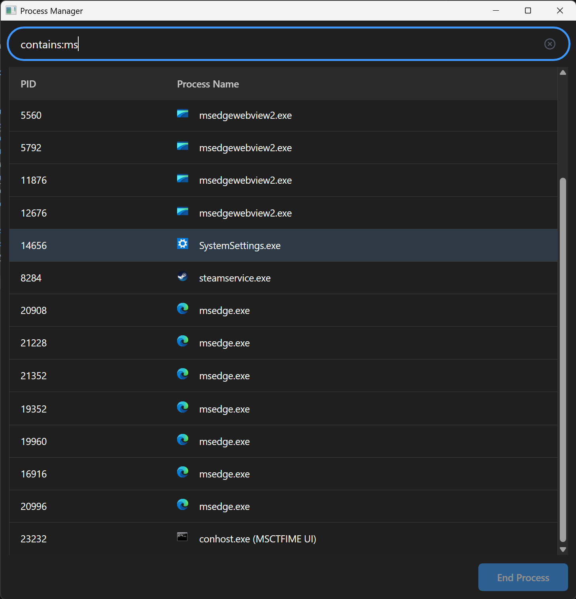

## Simple process manager for Windows 10 and Linux
* Search and filter processes by: 
    * PID (e.g. `pid: 3`)
    * Process name (e.g. `chrome`)
    * Window title (e.g. `Settings`)
    * Process name substring (e.g. `calc`)
    * Or any combination of the above
* End selected process
* View process executable path and icon

## Build Instructions
1. In the `typescript` directory, run `npm run build`.
2. In the `native` directory, create an `external` directory and clone [ConcurrentQueue](https://github.com/cameron314/concurrentqueue) and [stb](https://github.com/nothings/stb) into it. So, the file tree should look like `ProcessViewer/native/external/concurrentqueue` and `ProcessViewer/native/external/stb`.
3. Download and extract the latest [CEF Standard Distribution](https://cef-builds.spotifycdn.com/index.html) into the `external` directory, and rename the directory to `cef`. So the file tree should look like `ProcessViewer/native/external/cef`.
4. In the `native` directory, run `cmake cmake -S . -B out\build\x64-{Debug|Release}` and `cmake --build out\build\x64-{Debug|Release} --config {Debug|Release}`, or open the `native` directory in a CMake-compatible IDE and follow the typical build instructions.

